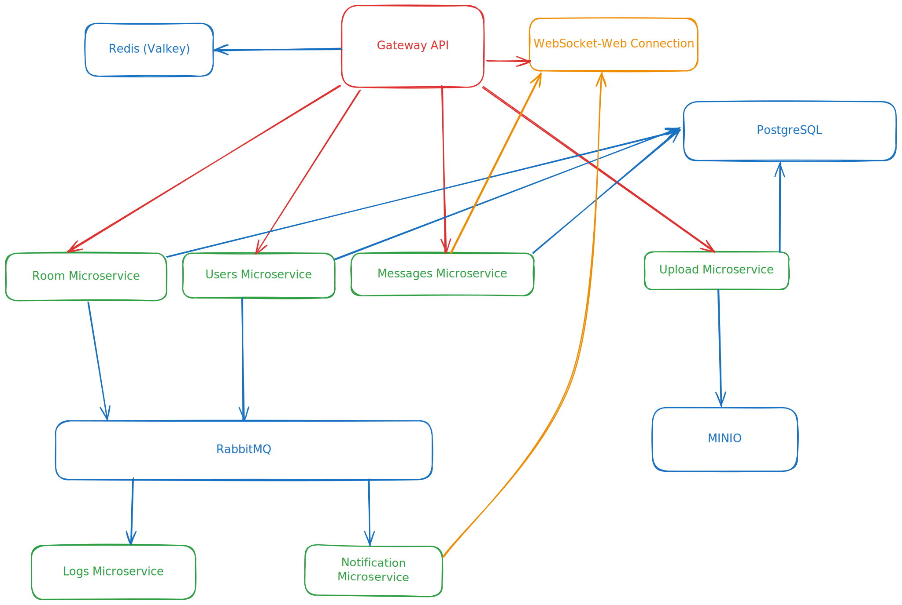

# What is it?
It's a simple chat-app (backend only) that I'm currently making for practicing microservice architecture and learning tools such as [minio](https://min.io/), [gRPC](https://grpc.io/) and Message Brockers (Currently I have [rabbitmq](https://www.rabbitmq.com/) in this project, but I'll probably switch to [Kafka](https://kafka.apache.org/), hence it makes more sence in my use-case)

## Project Structure
Every service is located inside **apps** folder, while every library located inside of **shared**

Project is configured using pnpm workspaces, **shared** have separate build scripts, every app has unified script **scripts/build.js**

gRPC .proto files are located under **shared/grpc/internal** and code/types for it are generated with `pnpm build` in it's folder

Every app, that's beign worked on has it's own README.md with short explanation of underlying functionality/usage

## Development

For development I would recommend to use [nix](https://nixos.org/download/) develop, it would install every dependency that might need need and install lefthook for precommit checks :>

Don't forget to build every package inside shared library and install js dependencies
You should be able to run it with simple `docker compose up --build` command